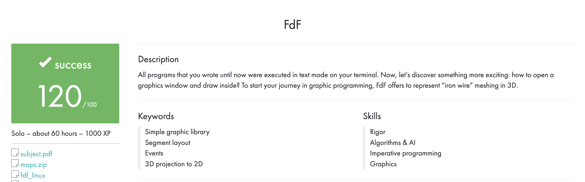

# Português 🇧🇷🇵🇹

<details>
  <summary>
    Saiba mais
  </summary>
  
  # Libft
Projeto da [42](https://www.42lisboa.com) - Rank 2 - FDF

<details>
  <summary><strong>🏆 Meu desempenho</strong></summary><br />

  
</details>

## 📌 Habilidades

> Habilidades desenvolvidas:

- Utilização de ponteiros
- Noções de endereço de memória
- Noções de alocação e dealocação de memória
- Entendimento de lista encadeadas
- Entendimento sobre tipos
- Entendimento sobre struct
- Entendimento de árvores binárias
- Projecção isométrica
- Transformação de coordenadas
- Rotação de coordenadas
- Translação de coordenadas
- Escala de coordenadas


## ‍💻 Softwares necessários

- C compiler (clang)
- GNU make
- mlx (Minilibx/42[Library])

## ⬇️ Compilando arquivos

```bash
	make #Compila o executável 'fdf'.
	make all #Faz exatamente a mesma coisa que apenas 'make'.
	make fdf #Faz exatamente a mesma coisa que apenas 'make'.
	#PS: Todos os comandos listados acima criam a biblioteca, além de compilar as funções.
```

## ⚡ Testando o projeto

```
	Para testar este projeto é necessário um arquivo de texto, na raiz deste projeto exite um diretório chamado 'test_maps', onde existem alguns arquivos de texto para testes.
	Basta executar o binário 'fdf' com o arquivo de texto como argumento.
	Exemplo: ./fdf test_maps/42.fdf
	PS: Este projeto foi desenvolvido para rodar em sistemas operacionais Linux.
```

## Time de desenvolvimento

> Projeto individual:

<table>
    <tr>
      <td>
        
        <h4 align="center">Alê Rabelo</h4>
      </td>
    </tr>
  </table>

## 💬 Contatos

<div align="center" style="display: inline_block">
  <a href="https://www.linkedin.com/in/al%C3%AA-emmanuel-rabelo-guedes/" target="_blank">
    
  </a> 
   <a href="mailto:rabeloguedes@proton.me">
     
  </a>
</div>

</details>

# English 🇺🇸🇬🇧

<details>
  <summary>
    More
  </summary>
  
  # Libft
Project from [42](https://www.42lisboa.com/) - Rank 2 - FDF

<details>
  <summary><strong>🏆 My accomplishment</strong></summary><br />

  

</details>

## 📌 Skills

> Practiced skills:

- Usage of pointers
- Understanding of memory addresses
- Understanding of memory allocation and deallocation
- Understanding of linked lists
- Understanding of types
- Understanding of structs
- Understanding of binary trees
- Isometric projection
- Coordinate transformation
- Coordinate rotation
- Coordinate translation
- Coordinate scaling

## ‍💻 Required Softwares

- C compiler (clang)
- GNU make

## ⬇️ Compiling files

```bash
	make #Compile the executable 'fdf'.
	make all #Do exactly what the above command does.
	make fdf #Do exactly what the above command does.
	#PS: All the above commands, will create the library, not just compile the functions.
```

## ⚡ Testing the project

```
	To test this project, a text file is required. In the root of this project, there is a directory called 'test_maps', where there are some text files for testing.
	Just run the 'fdf' binary with the text file as an argument.
	Example: ./fdf test_maps/42.fdf
	PS: This project was developed to run on Linux operating systems.
```

## Squad

> Single person project:

<table>
    <tr>
      <td>
        
        <h4 align="center">Alê Rabelo</h4>
      </td>
    </tr>
  </table>

## 💬 Contact

<div align="center" style="display: inline_block">
  <a href="https://www.linkedin.com/in/al%C3%AA-emmanuel-rabelo-guedes/" target="_blank">
    
  </a> 
   <a href="mailto:rabeloguedes@proton.me">
     
  </a>
</div>

</details>

# Deutsch 🇩🇪

<details>
  <summary>
    Mehr
  </summary>
  
  # Libft
Projekt von [42](https://www.42lisboa.com/) - Rank 2 - FDF

<details>
  <summary><strong>🏆 Meine Leistung</strong></summary><br />

  
</details>

## 📌 Fähigkeiten

> Ausgeübte Fähigkeiten:

- Verwendung von Zeigern
- Verständnis von Speicheradressen
- Verständnis von Speicherzuweisung und -freigabe
- Verständnis von verketteten Listen
- Verständnis von Typen
- Verständnis von Strukturen
- Verständnis von Binärbäumen
- Isometrische Projektion
- Koordinatentransformation
- Koordinatenrotation
- Koordinatentranslation
- Koordinatenskalierung

## ‍💻 Benötigte Software

- C compiler (clang)
- GNU make

## ⬇️ Dateien zusammenstellen

```bash
	make #Kompilieren die fdf binäre Datei.
	make all #Machen Sie genau das aus, was der obige Befehl bewirkt.
	make fdf #Machen Sie genau das, was der obige Befehl bewirkt.
	#PS: Alle oben genannten Befehle erstellen die Bibliothek und kompilieren nicht nur die Funktionen.
```

## ⚡ Projekt Testing

```
	Zum Testen dieses Projekts wird eine Textdatei benötigt. Im Stammverzeichnis dieses Projekts gibt es ein Verzeichnis namens "test_maps", in dem einige Textdateien zum Testen vorhanden sind.
	Führen Sie einfach die Binärdatei "fdf" mit der Textdatei als Argument aus.
	Beispiel: ./fdf test_maps/42.fdf
	PS: Dieses Projekt wurde für Linux-Betriebssysteme entwickelt.
```

## Entwickungsteam

> Einzelperson Projekt:

  <table>
    <tr>
      <td>
        
        <h4 align="center">Alê Rabelo</h4>
      </td>
  </table>

## 💬 Kontakt

<div align="center" style="display: inline_block">
  <a href="https://www.linkedin.com/in/al%C3%AA-emmanuel-rabelo-guedes/" target="_blank">
    
  </a> 
   <a href="mailto:rabeloguedes@proton.me">
     
  </a>
</div>

</details>
